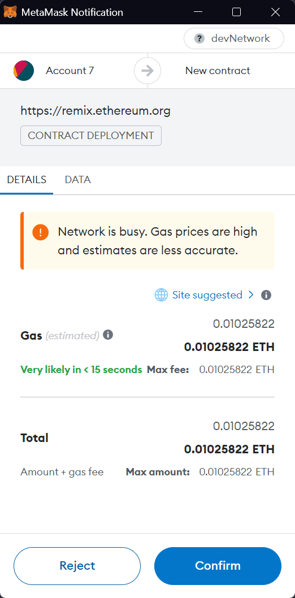
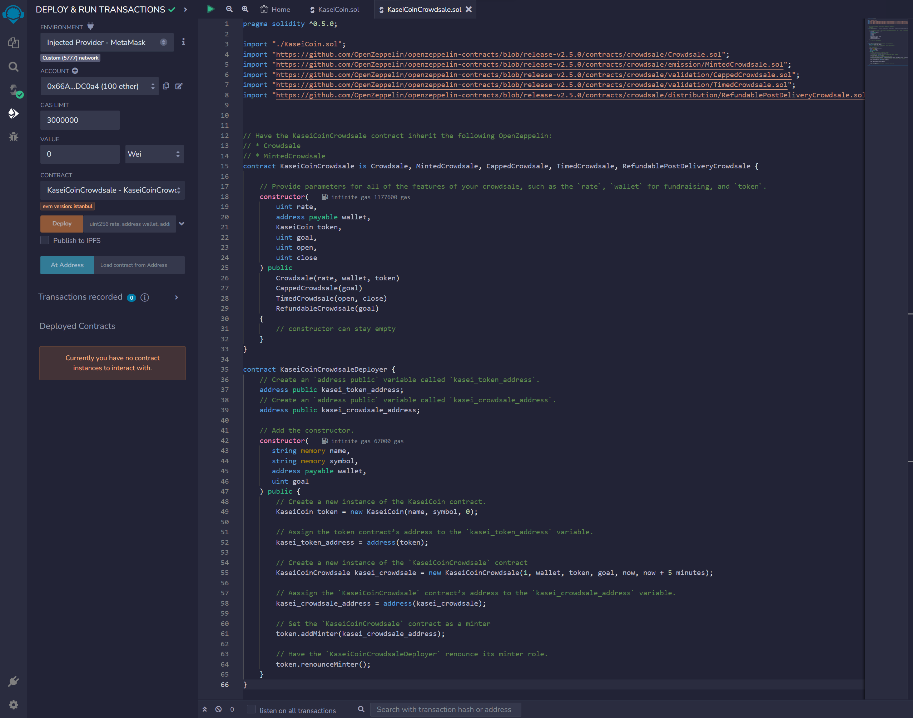
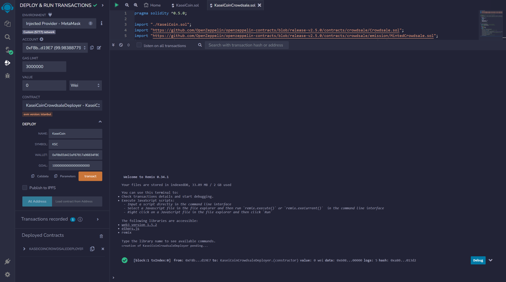
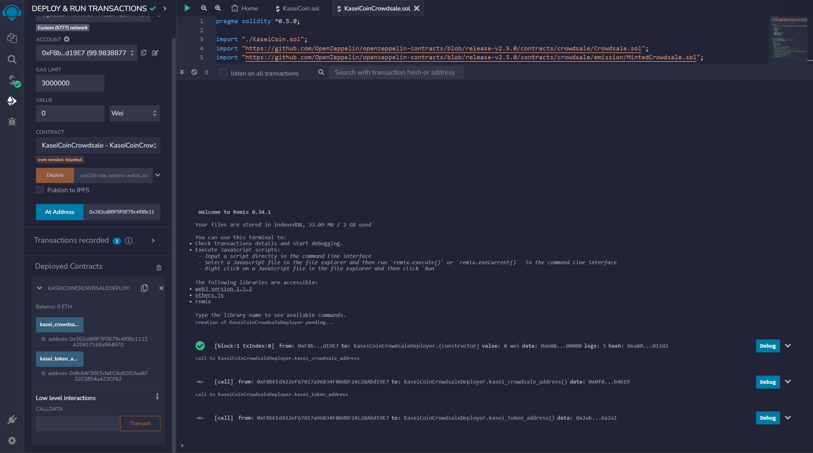
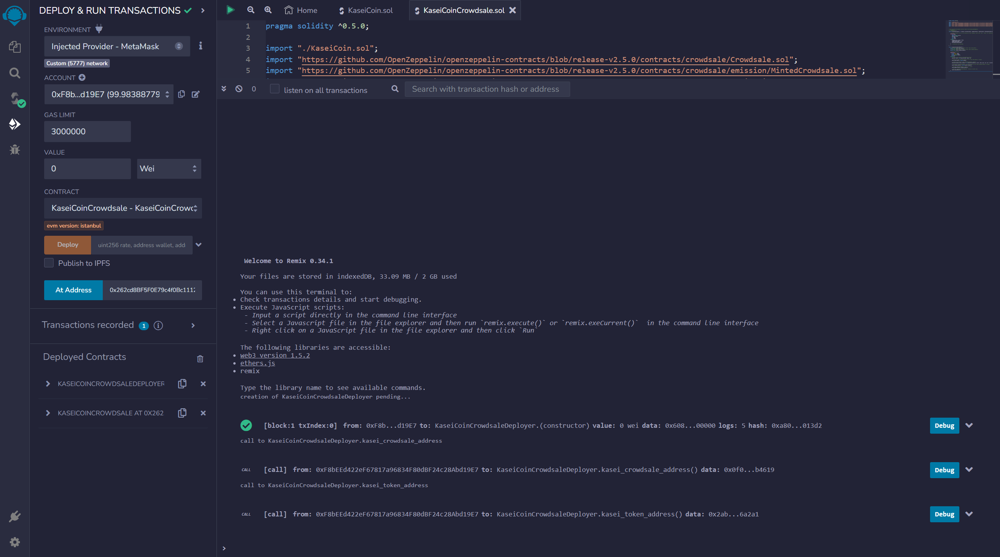
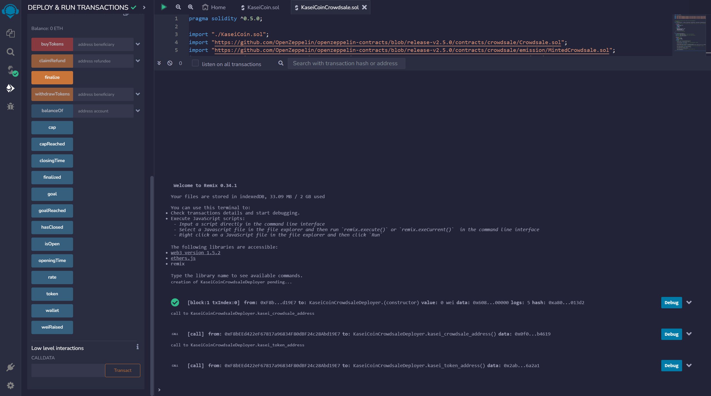

# advanced-solidity-homework
Module 21 Challenge: Martian Token Crowdsale

## Evaluation evidence
### Ganache initialized
  
The addresses used in this demonstration were obtained from a Ganache workspace and imported into MetaMask on a network connected to the Ganache workspace.

### KaseiCoin contract compiled
  
The KaseiCoin contract was compiled using Solidity compiler 0.5.17 (the compiler version used for all lesson work) in the `SOLIDITY COMPILER` section of Remix - Ethereum IDE.

### KaseiCoinCrowdsale contract compiled
  
The KaseiCoinCrowdsale contract was compiled using Solidity compiler 0.5.17 (the compiler version used for all lesson work) in the `SOLIDITY COMPILER` section of Remix - Ethereum IDE.

### KaseiCoinCrowdsaleDeployer contract compiled
  
The KaseiCoinCrowdsale contract was compiled using Solidity compiler 0.5.17 (the compiler version used for all lesson work) in the `SOLIDITY COMPILER` section of Remix - Ethereum IDE.

### KaseiCoinCrowdsaleDeployer contract initialized, confirmed and deployed
#### Contract initialized and confirmed

|  |  |
| --- | --- |

The KaseiCoinCrowdsaleDeployer contract was initialized using the following inputs and values found in the `DEPLOY` function in the `DEPLOY & RUN TRANSACTIONS` section of Remix - Ethereum IDE:
- `NAME` => `KaseiCoin`
- `SYMBOL` => `KSC`
- `WALLET` => `0xD90aFeC47BD8e33A18233759869a5dA598F9673B`
> **Note:** The `WALLET` address was taken from address index `2` in Ganache.

Upon clicking the `transact` button, a transaction confirmation prompt was provided by MetaMask.

#### Contract deployed
  
Upon clicking the `Confirm` button in the MetaMask prompt, the contract was deployed.

#### Contract functions
  
The deployed contract contains two functions:
- `kasei_crowdsale_address`
- `kasei_token_address`

#### Kasei crowdsale address
  
The Kasei crowdsale address can be obtained using the `kasei_crowdsale_address` function.
> **Note:** The Kasei crowdsale address is: `0x64F53c16E3782f392ea6B0939e1f5BF5719c1747`

#### Kasei token address
  
The Kasei token address can be obtained using the `kasei_token_address` function.
> **Note:** The Kasei token address is: `0x90Cd285dfc08f3e875fe1F29D36cB6019A619a83`

### KaseiCoinCrowdsale contract loaded
#### Contract loaded
  
The KaseiCoinCrowdsale contract was loaded using the `Load contract from Address` function located in the `DEPLOY & RUN TRANSACTIONS` section of Remix - Ethereum IDE. The address entered in the input was the Kasei crowdsale address. Upon clicking the `At Address` button, the contract was loaded.

#### Contract functions
  
The deployed contract contains five functions:
- `buyTokens`
- `rate`
- `token`
- `wallet`
- `weiRaised`

### KaseiCoin contract loaded
#### Contract initialized
  
The KaseiCoin contract was loaded using the `Load contract from Address` function located in the `DEPLOY & RUN TRANSACTIONS` section of Remix - Ethereum IDE. The address entered in the input was the Kasei token address. Upon clicking the `At Address` button, the contract was loaded.

#### Contract functions
  
The deployed contract contains 15 functions:
- `addMinter`
- `approve`
- `decreaseAllowance`
- `mint`
- `increaseAllowance`
- `renounceMinter`
- `transfer`
- `transferFrom`
- `allowance`
- `balanceOf`
- `decimals`
- `isMinter`
- `name`
- `symbol`
- `totalSupply`

### First token purchase
#### Token purchase initialized and confirmed

|  |  |
| --- | --- |

The first token purchase was initialized using the following inputs:
- `VALUE` => `10` and `Ether`
- `beneficiary` => `0x325e7365f2208Cf281d2AE62F6E3f2FE933b8F5e`
> **Note:** The `beneficiary` address was taken from address index `1` in Ganache.

The `VALUE` inputs are located in the `DEPLOY & RUN TRANSACTIONS` section of Remix - Ethereum IDE. The `beneficiary` input is located in the `buyTokens` function of the `KaseiCoinCrowdsale` contract.

Upon clicking the `transact` button in the `buyTokens` function, a transaction confirmation prompt was provided by MetaMask.

#### Token purchase completed
  
Upon clicking the `Confirm` button in the Metamask prompt, the token purchase was completed.

#### Crowdsale confirmation
  
Crowdsale confirmation of the token purchase was obtained using the `weiRaised` function of the `KaseiCoinCrowdsale` contract. Upon clicking the `weiRaised` button, the value of Wei raised from the purchase was displayed.
> **Note:** The value of Wei raised from the purchase was 10000000000000000000.

#### Beneficiary confirmation
  
Beneficiary confirmation of the token purchase was obtained using the `balanceOf` function of the `KaseiCoin` contract. The address entered in the `account` input was the `beneficiary` address used to initialize the token purchase. Upon clicking the `call` button in the `balanceOf` function, the value of the token purchase in Wei was displayed.
> **Note:** The Wei value of 10 Ether is 10000000000000000000.

### Second token purchase
#### Token purchase initialized and confirmed

|  |  |
| --- | --- |

The second token purchase was initialized using the following inputs:
- `VALUE` => `31500000000000000000` and `Wei`
- `beneficiary` => `0x4564415Df66508974afbf630Cd1a44196AA8d30f`
> **Note:** The `beneficiary` address was taken from address index `0` in Ganache.

The `VALUE` inputs are located in the `DEPLOY & RUN TRANSACTIONS` section of Remix - Ethereum IDE. The `beneficiary` input is located in the `buyTokens` function of the `KaseiCoinCrowdsale` contract.

Upon clicking the `transact` button in the `buyTokens` function, a transaction confirmation prompt was provided by MetaMask.

#### Token purchase completed
  
Upon clicking the `Confirm` button in the Metamask prompt, the token purchase was completed.

#### Crowdsale confirmation
  
Crowdsale confirmation of the token purchase was obtained using the `weiRaised` function of the `KaseiCoinCrowdsale` contract. Upon clicking the `weiRaised` button, the value of Wei raised from the first two purchases was displayed.
> **Note:** The value of Wei raised from the first two purchases was 41500000000000000000.

#### Beneficiary confirmation
  
Beneficiary confirmation of the token purchase was obtained using the `balanceOf` function of the `KaseiCoin` contract. The address entered in the `account` input was the `beneficiary` address used to initialize the token purchase. Upon clicking the `call` button in the `balanceOf` function, the value of the token purchase in Wei was displayed.

### Total supply confirmation
  
The total supply of purchased tokens was obtained using the `totalSupply` function of the `KaseiCoin` contract. Upon clicking the `totalSupply` button, the value of the total supply in Wei was displayed.
> **Note:** The value of the total supply in Wei was 41500000000000000000.

### Ganache results
  
The result of all contract functions performed was visible in the Ganache workspace.

## Optional: Extend the crowdsale contract by using OpenZeppelin
### Ganache initialized
  
The addresses used in this demonstration were obtained from a Ganache workspace.

### KaseiCoinCrowdsale and KaseiCoinCrowdsaleDeployer contracts extended
  
To accommodate the functions of a capped crowdsale, a timed crowdsale, and a crowdsale refund, the KaseiCoinCrowdsale contract was extended to incorporate the `CappedCrowdsale`, `TimedCrowdsale` and `RefundablePostDeliveryCrowdsale` contracts.

### KaseiCoinCrowdsaleDeployer contract initialized, confirmed and deployed
#### Contract initialized and confirmed

|  |  |
| --- | --- |

The KaseiCoinCrowdsaleDeployer contract was initialized using the following inputs and values found in the `DEPLOY` function in the `DEPLOY & RUN TRANSACTIONS` section of Remix - Ethereum IDE:
- `NAME` => `KaseiCoin`
- `SYMBOL` => `KSC`
- `WALLET` => `0xD90aFeC47BD8e33A18233759869a5dA598F9673B`
> **Note:** The `WALLET` address was taken from address index `2` in Ganache.

Upon clicking the `transact` button, a transaction confirmation prompt was provided by MetaMask.
#### Contract deployed
  
The KaseiCoinCrowdsaleDeployer contract was deployed using the following inputs and values found in the `DEPLOY` function in the `DEPLOY & RUN TRANSACTIONS` section of Remix - Ethereum IDE:
- `NAME` => `KaseiCoin`
- `SYMBOL` => `KSC`
- `WALLET` => `0xD90aFeC47BD8e33A18233759869a5dA598F9673B`
- `GOAL` => `100000000000000000000`
> **Note:** The `WALLET` address was taken from address index `3` in Ganache. The `GOAL` value is displayed in Wei and equates to 100 Ether.

Upon clicking the `transact` button, a transaction confirmation prompt was provided by MetaMask. Upon clicking the `Confirm` button in the Metamask prompt, the contract was deployed.

#### Contract functions
  
The deployed contract contains two functions:
- `kasei_crowdsale_address`
- `kasei_token_address`

#### Kasei crowdsale address
  
The Kasei crowdsale address can be obtained using the `kasei_crowdsale_address` function.
> **Note:** The Kasei crowdsale address is: `0x262cd8BF5F0E79c4f0Bc1112A20417166a964970`

#### Kasei token address
  
The Kasei token address can be obtained using the `kasei_token_address` function.
> **Note:** The Kasei token address is: `0x9c64F30E5cfaEC6e82f03aa8732C0854a423CF62`

### KaseiCoinCrowdsale contract loaded
#### Contract loaded
  
The KaseiCoinCrowdsale contract was loaded using the `Load contract from Address` function located in the `DEPLOY & RUN TRANSACTIONS` section of Remix - Ethereum IDE. The address entered in the input was the Kasei crowdsale address. Upon clicking the `At Address` button, the contract was loaded.

#### Contract functions
  
The deployed contract contains 18 functions:
- `buyTokens`
- `claimRefund`
- `finalize`
- `withdrawTokens`
- `balanceOf`
- `cap`
- `capReached`
- `closingTime`
- `finalized`
- `goal`
- `goalReached`
- `hasClosed`
- `isOpen`
- `openingTime`
- `rate`
- `token`
- `wallet`
- `weiRaised`

### KaseiCoin contract loaded
#### Contract initialized
  
The KaseiCoin contract was loaded using the `Load contract from Address` function located in the `DEPLOY & RUN TRANSACTIONS` section of Remix - Ethereum IDE. The address entered in the input was the Kasei token address. Upon clicking the `At Address` button, the contract was loaded.

#### Contract functions
  
The deployed contract contains 15 functions:
- `addMinter`
- `approve`
- `decreaseAllowance`
- `mint`
- `increaseAllowance`
- `renounceMinter`
- `transfer`
- `transferFrom`
- `allowance`
- `balanceOf`
- `decimals`
- `isMinter`
- `name`
- `symbol`
- `totalSupply`

### Token purchase
#### Token purchase initialized and confirmed

|  |  |
| --- | --- |

In this demonstration, three token purchases were performed. The purchases were initialized using the following inputs:
- Token purchase 1
  - `VALUE` => `40` and `Ether`
  - `beneficiary` => `0xB218A34D86085c21D0d773eF75661a74081C0065`
  > **Note:** The `beneficiary` address was taken from address index `2` in Ganache.
- Token purchase 2
  - `VALUE` => `40` and `Ether`
  - `beneficiary` => `0x8e5e57b2De2D520376c428A020adAB0b7B6Df860`
  > **Note:** The `beneficiary` address was taken from address index `1` in Ganache.
- Token purchase 3
  - `VALUE` => `20` and `Ether`
  - `beneficiary` => `0x34C1900E54F3849c39a9BC8202b6eE50C3567FA7`
  > **Note:** The `beneficiary` address was taken from address index `0` in Ganache.

The `VALUE` inputs are located in the `DEPLOY & RUN TRANSACTIONS` section of Remix - Ethereum IDE. The `beneficiary` input is located in the `buyTokens` function of the `KaseiCoinCrowdsale` contract.

Upon clicking the `transact` button in the `buyTokens` function, a transaction confirmation prompt was provided by MetaMask.

#### Token purchase completed
  
Upon clicking the `Confirm` button in the Metamask prompt, the token purchase was completed.

#### Beneficiary confirmation
  
Beneficiary confirmation of each token purchase was obtained using the `balanceOf` function of the `KaseiCoin` contract. The address entered in the `account` input was the `beneficiary` address used to initialize the token purchase. Upon clicking the `call` button in the `balanceOf` function, the value of the token purchase in Wei was displayed.
> **Note:** The Wei value of 40 Ether is 40000000000000000000.

#### Crowdsale confirmation
  
Crowdsale confirmation of each token purchase was obtained using the `weiRaised` function of the `KaseiCoinCrowdsale` contract. Upon clicking the `weiRaised` button, the value of Wei raised from the purchase was displayed.
> **Note:** The value of Wei raised from all purchases was 100000000000000000000.

### Crowdsale finalized
  
Once the crowdsale goal was reached and the close date had passed, the crowdsale was finalized using the `finalize` function in the `KaseiCoinCrowdsale` contract.

### Tokens withdrawn
  
After finalizing the crowdsale, tokens were withdrawn using the `withdrawTokens` function in the `KaseiCoinCrowdsale` contract. Three withdrawals were performed using each of the addresses originally used for purchasing tokens.

### Tokens imported

|  |  |
| --- | --- |

To view the KaseiCoin in a MetaMask wallet, the token was first manually added to MetaMask using the `KaseiCoin` contract address. After confirming the manual addition by clicking the `Add custom token` button, the import was confirmed by clicking the `Import tokens` button on the subsequent screen.

### Ganache results
  
The result of all contract functions performed was visible in the Ganache workspace.

### Process for buying KaseiCoin
The following instructions are strictly for buying KaseiCoin in Remix - Ethereum IDE, and assume the buyer has connected their wallet to Remix - Ethereum IDE.

#### Enter address and amount

|  |  |
| --- | --- |

To purchase KaseiCoin, a buyer must first enter their wallet address and the Ether value of the amount of KaseiCoin they wish to purchase. The buyer's wallet address must be entered into the `beneficiary` input located in the `buyTokens` function of the `KaseiCoinCrowdsale` contract, and their purchase amount must be entered in the `VALUE` inputs located in the `DEPLOY & RUN TRANSACTIONS` section of Remix - Ethereum IDE.
> In the demonstration, the buyer has entered the following information:
> - `VALUE` => `40` and `Ether`
> - `beneficiary` => `0xB218A34D86085c21D0d773eF75661a74081C0065`
> **Note:** The `beneficiary` address was taken from address index `2` in Ganache.

The buyer may then click the `transact` button in the `buyTokens` function, which will open a transaction confirmation prompt in MetaMask.

#### Token purchase completed
  
To confirm the transaction, the buyer must click the `Confirm` button in the Metamask prompt. Upon doing so, the token purchase is complete.

#### Beneficiary confirmation
  
The buyer may confirm their purchase of KaseiCoin using the `balanceOf` function of the `KaseiCoin` contract. The address entered in the `account` input must be the address the buyer used to initialize the token purchase. Upon clicking the `call` button in the `balanceOf` function, the value of the buyer's token purchase in Wei is displayed.
> In the demonstration, the value of the buyer's token purchase in Wei is 40000000000000000000.

## Other information
- All work for the KaseiCoin contract can be found in the [KaseiCoin.sol](https://github.com/julianritchey/advanced-solidity-homework/blob/main/KaseiCoin.sol) file.
- All work for the KaseiCoinCrowdsale and KaseiCoinCrowdsaleDeployer contracts can be found in the [KaseiCoinCrowdsale.sol](https://github.com/julianritchey/advanced-solidity-homework/blob/main/KaseiCoinCrowdsale.sol) file.
- All screenshots used in this assignment can be found in the [Evaluation_Evidence](https://github.com/julianritchey/advanced-solidity-homework/tree/main/Evaluation_Evidence) folder.